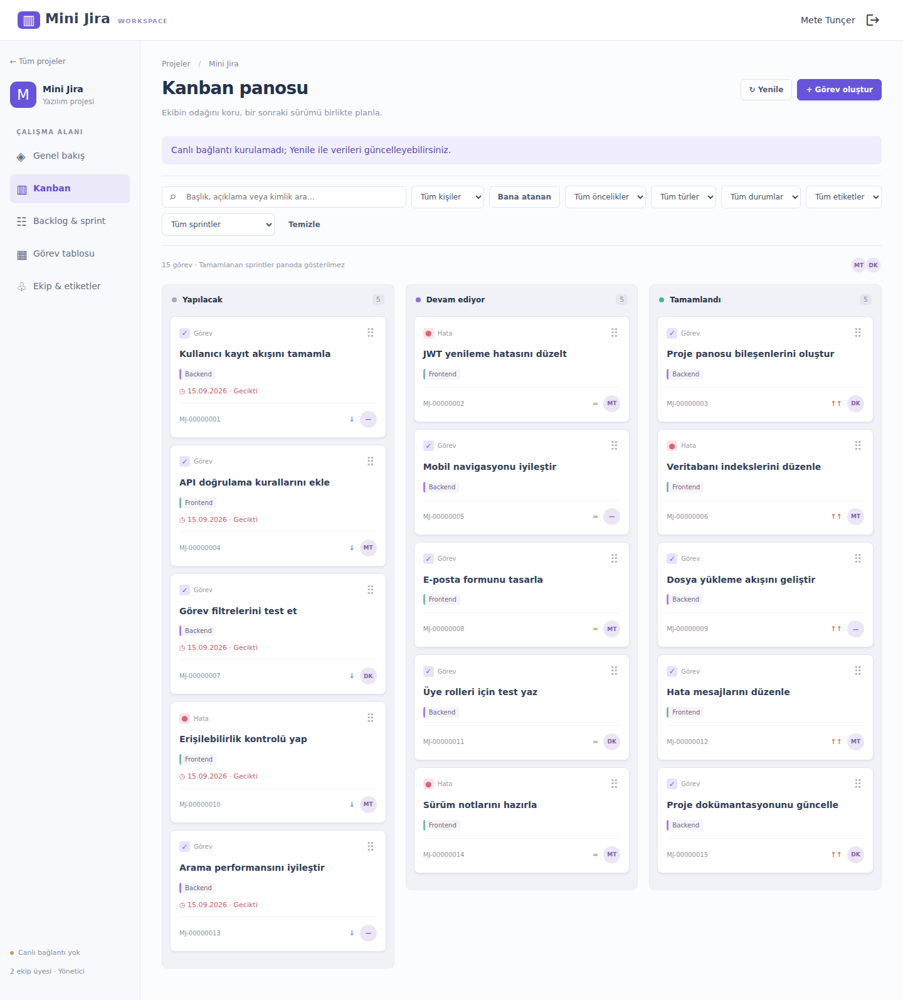

# Mini Jira

Angular, ASP.NET Core ve PostgreSQL ile geliştirilen proje ve görev yönetimi uygulaması.



Görseller test verileriyle oluşturulmuştur; test sırasında canlı bağlantı kapalıdır.

## Özellikler

- Kullanıcı kaydı ve JWT ile giriş; proje bazında yönetici/üye rolleri.
- Kanban, sürükle-bırak, görev atama, yorumlar, etiketler ve dosya ekleri.
- Sprint/backlog planlaması; sprint tamamlandığında bitmeyen işlerin backlog'a dönmesi.
- Görev tablosu, filtreleme, sıralama, sayfalama, toplu düzenleme ve CSV.
- Proje özeti ve SignalR ile canlı güncellemeler.
- Sade görev türleri: **Görev** ve **Hata**.

## Teknolojiler

.NET 8 / ASP.NET Core · EF Core / PostgreSQL · Identity / JWT · Angular 21 /
Material / CDK · Signals · SignalR · Playwright


## Kurulum

Gerekenler: .NET 8 SDK, Node.js 24.x ve PostgreSQL. PostgreSQL'i Docker ile çalıştırmak
istersen Docker Compose da gerekir. Komutları repository kökünde çalıştır.

### 1. Veritabanı

Docker kullanıyorsan `.env.example` dosyasını `.env` olarak kopyala ve
`POSTGRES_PASSWORD` değerine kendi yerel parolanı yaz. Ardından:

```sh
docker compose up -d
docker compose ps
```

Compose **yalnızca PostgreSQL'i** başlatır. Docker kullanmıyorsan yerel PostgreSQL'de
boş bir `minijira` veritabanı oluşturabilirsin; pgAdmin bir yönetim aracıdır.

**Yalnızca boş veritabanı için**, Docker ile şemayı yükle:

```sh
docker cp backend/sql/001_fresh_database.sql minijira-postgres:/tmp/schema.sql
docker exec minijira-postgres psql -U minijira -d minijira -v ON_ERROR_STOP=1 -f /tmp/schema.sql
```

Yerel PostgreSQL kullanıyorsan aynı dosyayı pgAdmin Query Tool üzerinden veya
`psql -h localhost -U <kullanıcı> -d minijira -v ON_ERROR_STOP=1 -f backend/sql/001_fresh_database.sql`
ile çalıştır. Mevcut veritabanı için önce [yükseltme notlarını](docs/database.md) oku.

### 2. Backend yapılandırması

Gerçek parolaları ve JWT anahtarını kaynak koda yazma. Aşağıdaki yer tutucuları kendi
değerlerinle değiştir. Bağlantı dizesindeki kullanıcı/parola PostgreSQL kurulumunla eşleşmeli:

```sh
dotnet user-secrets set "ConnectionStrings:Default" "Host=localhost;Port=5432;Database=minijira;Username=minijira;Password=<veritabani-parolan>" --project backend/src/MiniJira.Api
dotnet user-secrets set "Jwt:Key" "<rastgele-64-karakterlik-anahtar>" --project backend/src/MiniJira.Api
```

Rastgele JWT anahtarı üretmek için:

```sh
node -e "console.log(require('node:crypto').randomBytes(32).toString('hex'))"
```

Üretilen değeri ikinci komutta kullan; repository'ye ekleme.
API, veritabanı bağlantısı veya geçerli JWT anahtarı yoksa açıklayıcı bir hatayla durur.
`.env` yalnızca Compose tarafından okunur; API ayarlarının yerine geçmez.

```sh
dotnet build backend/MiniJira.sln
dotnet run --project backend/src/MiniJira.Api --launch-profile http
```

API: http://localhost:5000 · Swagger: http://localhost:5000/swagger

### 3. Frontend

Ayrı terminalde:

```sh
cd frontend
npm ci
npm start
```

http://localhost:4200 adresinde kayıt ol ve proje oluştur. Bir kişiyi projeye
eklemeden önce o kişinin kayıt olması gerekir; uygulama e-posta daveti göndermez.

## Testler

Backend erişim testleri (PostgreSQL gerektirmez):

```sh
dotnet test backend/tests/MiniJira.Tests/MiniJira.Tests.csproj
```

Frontend:

```sh
cd frontend
npm run build
npx playwright install chromium
npm run test:e2e
```

Canlı API ve ayrı test veritabanı açıkken **repository kökünde**:

```sh
python tests/api_smoke.py
node tests/realtime_smoke.cjs
```

Playwright testleri mock API yanıtları kullanır. Diğer iki betik gerçek API'yi kullanır;
test kullanıcıları oluşturur ve bu hesaplar veritabanında kalır.
Kapsam ve bu paketin doğrulama sonuçları: [Test notları](docs/testing.md).

## Yapı ve sınırlar

- [Mimari ve veri modeli](docs/architecture.md)
- [Veritabanı kurulumu ve yükseltme](docs/database.md)

Grid filtreleme/sayfalama istemci tarafındadır. Toplu işlemler tek transaction değildir;
kısmi başarısızlıkta kalan seçim korunur. Eşzamanlı alan düzenlemelerinde son kayıt kazanır.
Dosyalar yerel diskte tutulur; içerik taraması ve silinen görevlere ait dosyaların
otomatik temizliği sonraki çalışmalardır. Refresh token, audit trail ve tarihsel
burndown/velocity bulunmaz.

Üretime geçerken HTTPS, CORS, kalıcı dosya depolama ve gizli ayarları kendi ortamına göre
yapılandır. API ortam değişkenleri: `ConnectionStrings__Default`, `Jwt__Key`,
`Cors__AllowedOrigins__0`. Frontend API/Hub adresleri `frontend/src/environments/` altındadır.
