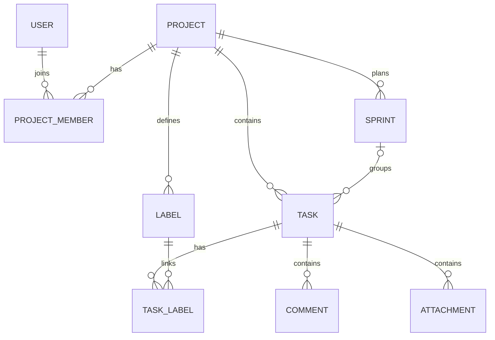

# Mimari

## Backend

| Katman | Sorumluluk |
|---|---|
| Domain | Proje, üyelik, görev, sprint, etiket, yorum ve dosya varlıkları |
| Application | DTO'lar, servis arayüzleri, uygulama hataları |
| Infrastructure | EF Core, Identity/JWT, servis uygulamaları, dosya depolama, SignalR |
| Api | HTTP uç noktaları, middleware, DI ve uygulama başlangıcı |

Controller isteği alır; servis proje üyeliğini, rolü ve iş kurallarını doğrular.
EF Core veriyi PostgreSQL'e kaydeder, DTO istemciye döner. Normal entity nesneleri
doğrudan API yanıtı olarak kullanılmaz.

Şema sadeleştirilmiştir: görevlerin oluşturan/atanan kullanıcı alanları, yorum yazarı
ve dosyayı yükleyen kullanıcı da kullanıcı kimliklerine bağlıdır.
Backlog ayrı bir tablo veya durum değildir: `SprintId = null` olan görevlerdir.
Pano ayrı bir entity gerektirmez; görevler durumlarına göre gruplanır.

## Frontend

`core/` API servislerini, oturum yönetimini ve modelleri içerir. `features/` ekranları
içerir. Pano sayfası `BoardComponent` tarafından açılır; sayfa başına bir
`WorkspaceStore` oluşturulur. Signals/computed ile tek görev listesinden görünümler
türetilir. Sekmeler değiştirilirken görevler kopyalanmaz.

Pano bileşenleri: `kanban-board`, `task-grid`, `sprint-planning`, `project-summary`,
`project-team`, `task-filters`, `task-create`, `sprint-form`.
Bu bileşenler yalnızca aynı çalışma alanındaki store'u paylaşır. Store API işlemlerini
ve ortak state'i, alt bileşenler kendi şablonlarını yönetir. Ortak stiller `app-board`
altında sınırlandırılır; sayfa dışına uygulanmaz.

## İş kuralları

- Üyeler görevleri düzenleyebilir; sprint ve proje üyeliği yönetimi Admin gerektirir.
- Atanan kullanıcı ve etiketler görevle aynı projeye ait olmalıdır.
- Bir projede tek aktif sprint bulunabilir; veritabanındaki koşullu unique index de bunu korur.
- Sprint tamamlanınca bitmeyen işler mevcut durumları korunarak backlog'a döner.
- Durum, etiket, yorum ve dosya işlemleri hemen; diğer görev alanları Kaydet ile kaydedilir.
- Toplu işlemler sıralıdır. Başarıyla kaydedilen işler geri alınmaz; kalanlar seçili kalır.
- Kimlikler GUID'dir; ekranda kısa `MJ-xxxxxxxx` gösterilir. Artan görev numarası uygulanmamıştır.

## Uyumluluk

Arayüzde Görev/Hata dışında tür veya Story Point alanı yoktur. Backend ve SQL'deki
eski `IssueType` ve `StoryPoints` değerleri veri kaybını önlemek için korunur.
Eski Story/Epic kayıtları arayüzde Görev olarak gösterilir. Başka bir alanın
düzenlenmesi eski türü veya puanı değiştirmez; kullanıcı türü değiştirirse yeni seçim kaydedilir.

## Canlı güncellemeler

Hub girişinde kimlik doğrulama zorunludur. İlk bağlantı ve `JoinProject` çağrısı
proje üyeliğini denetler. Bildirimler proje/kullanıcı gruplarına gönderilir;
her yayında güncel üye listesi okunur. Üyeliği kaldırılan kullanıcı, açık bağlantısı
kalsa bile sonraki yayınların alıcı listesine girmez. Kaldırma öncesinde gönderilmiş
veriler istemciden geri alınamaz. JWT süresi dolduğunda bağlantı kapatılır.
Yeniden bağlantıda istemci veriyi API'den yükler.
